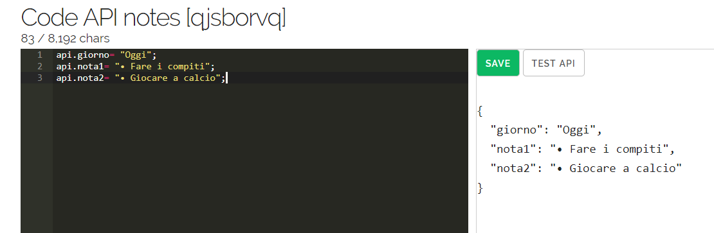

🆂🅺🆄🅻🅰🅿🅿

SkulApp has been made using Expo Snack as FRONT-END and Randomapi.com as BACK-END with APIs.

API used

{"results":[{"religione":"• Religione","tpi":"• TPI","motoria":"• Motoria","storia":"• Storia","sistemi":"• Sistemi","inglese":"• Inglese","gpo":"• GPO","ita":"• Italiano","info":"• Informatica","mate":"• Matematica","voto_religione":"• Religione: 8","voto_tpi":"• TPI: 8","voto_motoria":"• Motoria: 8","voto_storia":"• Storia: 8","voto_sistemi":"• Sistemi: 7","voto_inglese":"• Inglese: 7","voto_gpo":"• GPO: 6","voto_ita":"• Italiano: 6.5","voto_info":"• Info: 6.5","voto_mate":"• Matematica: 6"}],"info":{"seed":"a83249ae6d495cc8","results":"1","page":"1","version":"0.1","time":{"instruct":21,"generate":39},"user":{"username":"Luke00","tier":"Free [1]","results":"107 / 500","remaining":"393"}}}

Logic route

