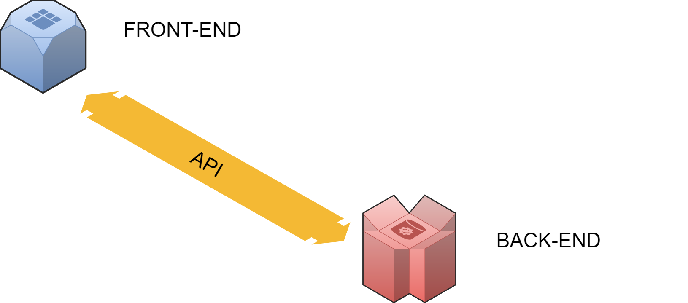

🅽🅾🆃🅴-🅰🅿🅿

Note-app has been made using Expo Snack as FRONT-END and Randomapi.com as BACK-END with APIs.

API used

{"results":[{"giorno":"->Oggi<-","nota1":"Fare i compiti","nota2":"Giocare a calcio"}],"info":{"seed":"16c842040d666b93","results":"1","page":"1","version":"0.1","time":{"instruct":14,"generate":6},"user":{"username":"Luke00","tier":"Free [1]","results":"1 / 500","remaining":"499"}}}

Logic route

